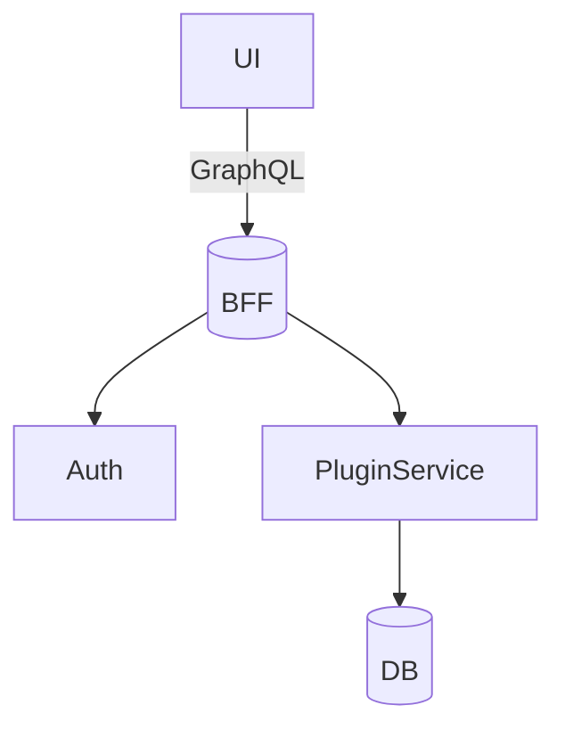

# Product Spec – Acme Widget 3.0

## TL;DR

Widget 3.0 introduces offline mode, revamped UI, and modular plugin support.

## Goals

| Goal | Metric |
|------|--------|
| Increase DAU | +30% |
| Boost NPS    | ≥ 60 |

## Non-Goals

- Android support (slated for Q3)

## User Stories

1. **As a mobile user** I can save drafts offline so I can edit without connectivity.
2. **As a power user** I can enable plugins via marketplace.

## Architecture Overview

## Milestones

| Phase | Dates | Owner |
|-------|-------|-------|
| Alpha | Jan 10–Feb 5 | @mei |
| Beta  | Feb 6–Mar 1 | @priya |
| GA    | Mar 15 | @omar |

